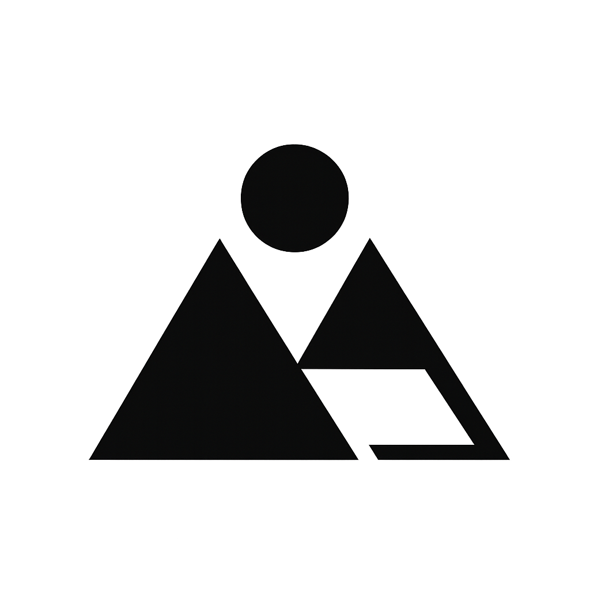

<p align="center">
  
</p>

# MoGuSpace

基于 Next.js + Material UI 的极简几何风格个人作品集，纯静态导出，无需服务端即可部署。

## 技术栈

- **框架**: Next.js 16 (App Router, `output: 'export'` 静态导出)
- **UI**: Material UI v6
- **动画**: Framer Motion
- **样式**: Emotion (CSS-in-JS)
- **内容**: Markdown (gray-matter) + YAML (js-yaml)
- **代码规范**: ESLint flat config (core-web-vitals + TypeScript)

## 功能特性

- 响应式网格布局：xs 1列 / sm 2列 / lg 3列 / xl 4列
- 项目按分类 (category) 自动分组，Sidebar 侧边栏快速导航
- 滚动触发背景虚化与彩色→黑白渐变
- Sticky 顶部导航栏，下滑隐藏上滑显示
- 明暗主题切换
- 页面过渡动画
- 移动端抽屉菜单 + Sidebar 自动隐藏
- 技能图标展示（内置 404 个技术 SVG 图标，支持 Dark/Light 变体）
- 项目详情页，支持 Markdown 渲染 + 目录导航 (TOC)
- SEO 优化（Open Graph + Twitter Card 元数据）

## 项目结构

```
├── content/                        # 内容目录
│   ├── config.yml                  # 站点配置（名称、技能、社交、友链等）
│   └── *.md                        # 项目 Markdown 文件
├── icons/                          # 技术图标（404 个 SVG）
├── public/                         # 静态资源
│   ├── bg.webp                     # 全局背景图
│   ├── logo.png                    # Logo
│   └── logo_bg.png                 # Logo 背景
├── src/
│   ├── app/
│   │   ├── layout.tsx              # 根布局（Theme + 背景层 + 导航）
│   │   ├── page.tsx                # 首页（Intro + Skills + Projects）
│   │   ├── not-found.tsx           # 404 页面
│   │   └── projects/[slug]/page.tsx # 项目详情动态路由
│   ├── components/                 # UI 组件
│   │   ├── Background.tsx          # 背景组件
│   │   ├── BackgroundLayer.tsx     # 背景图层
│   │   ├── BackToHome.tsx          # 返回首页按钮
│   │   ├── Footer.tsx              # 页脚
│   │   ├── HeroContainer.tsx       # 主容器
│   │   ├── Intro.tsx               # 个人介绍区
│   │   ├── Navbar.tsx              # 顶部导航栏
│   │   ├── PageTransitionProvider.tsx # 页面过渡动画
│   │   ├── ProjectCard.tsx         # 项目卡片
│   │   ├── ProjectCarousel.tsx     # 项目轮播
│   │   ├── ProjectInfo.tsx         # 项目信息
│   │   ├── ProjectToc.tsx          # 项目目录
│   │   ├── Sidebar.tsx             # 分类侧边栏
│   │   ├── SkillSection.tsx        # 技能展示
│   │   ├── SocialHeader.tsx        # 社交头部
│   │   ├── SocialLinks.tsx         # 社交链接
│   │   ├── TechStackBox.tsx        # 技术栈展示
│   │   └── ThemeProvider.tsx       # 主题切换
│   ├── lib/
│   │   ├── config.server.ts        # 读取 config.yml
│   │   ├── icons.server.ts         # 读取 SVG 图标
│   │   └── projects.ts             # 解析 Markdown 项目数据
│   └── theme/
│       └── theme.ts                # MUI 主题定义
├── next.config.ts                  # Next.js 配置
├── eslint.config.mjs               # ESLint 配置
└── package.json
```

## 快速开始

```bash
npm install
npm run dev        # 开发模式
npm run build      # 构建到 out/
npm run serve      # 本地预览构建结果
```

## 配置

编辑 `content/config.yml`：

```yaml
title: "MoGuSpace"
name: "YOUR NAME"
description: "A minimal geometric portfolio"
siteUrl: "https://yoursite.com"
siteLocale: "zh-CN"
background: "/bg.webp"

skills:
  - name: "React"
    icon: "React-Dark.svg"
    url: "https://react.dev"

navbar:
  - label: "GitHub"
    url: "#"

social:
  - label: "GitHub"
    url: "#"

friends:
  - label: "Friend Blog"
    url: "#"
```

## 添加项目

在 `content/` 下创建 Markdown 文件：

```markdown
---
title: 项目名称
description: 项目描述
category: Web
imageUrl: /cover.png
date: 2026-01-01
techStack:
  - name: "React"
    icon: "React-Dark.svg"
    url: "https://react.dev"
---

项目详情内容（支持 Markdown）...
```

**Frontmatter 字段说明：**

| 字段 | 必填 | 默认值 | 说明 |
|---|---|---|---|
| `title` | 否 | `"Untitled"` | 项目标题 |
| `description` | 否 | `""` | 项目描述 |
| `category` | 否 | `"Uncategorized"` | 分类，用于分组和侧边栏导航 |
| `imageUrl` | 否 | config 中 `siteImage` | 封面图路径 |
| `date` | 否 | 文件修改时间 | 日期 |
| `techStack` | 否 | `[]` | 技术栈列表，icon 引用 `icons/` 下的 SVG 文件名 |

## 图标

`icons/` 目录内置 404 个技术 SVG 图标，文件名格式为 `{TechName}.svg` / `{TechName}-Dark.svg` / `{TechName}-Light.svg`。在 config 或项目 frontmatter 的 `techStack` 中通过 `icon` 字段引用文件名即可。

## License

MIT
